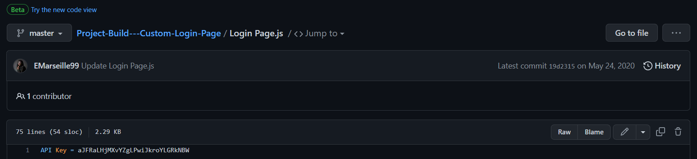

# L'espion

### Category
Threat Intelligence

### Tags
OSINT, GitHub, Bloodhound

### Walkthrough

Before we start, please download the challenge file. Upon unzipping, we found 3 files:
- Github.txt
- Office.jpg
- Webcam.png

With all preparation done, let's answer the questions!  

**Q1. File -> Github.txt:**   
**What is the API key the insider added to his GitHub repositories?**  

> aJFRaLHjMXvYZgLPwiJkroYLGRkNBW

Opening the zip, we found 3 files github.txt, office.jpg, and Webcam.png. In the Question Earlier it told us to open the GitHub.txt, inside the file, we can see a Github link https://github.com/EMarseille99. Q1 wants us to explore the Repositories, so I did and I found **"Login Page.js"** on the first Repository, and so we got our answer for Q1.

**Q2. File -> Github.txt** 
**What is the plaintext password the insider added to his GitHub repositories?** 
> PicassoBaguette99  

Still on the same repository and file, we just need to scroll down a bit to see a encoded password. We can simply decode it with [CyberChef](https://gchq.github.io/CyberChef/).

**Q3. File -> Github.txt**  
**What cryptocurrency mining tool did the insider use?**  
> xmrig  

I just looked at other repositories, there is a Repository's description that drew my attention. **"RandomX, CryptoNight, AstroBWT, and Argon2 CPU/GPU miner"**  

**Q4. What university did the insider go to?**  
> Sorbonee  

For me there are 2 things that I need to find this answer, first is the GitHub name which is **"EMarseille99"**, and her job's title **"Backend programmer"**. Well, the google result gives us some sites, but the most important one is **LinkedIn** since you'd put every achievement and past education there, so I clicked it and found the answer.  

**Q5. What gaming website the insider had an account on?**
> Steam  

Using a website called https://whatsmyname.app/, we can search using her Github name.  

We can see here, one of the results says that it has something to do with tf2items, tf2 ( Team Fortress 2 ) is a game ONLY available on steam. To verify this, I searched for the username in Steam.  

**Q6. What is the link to the insider Instagram profile?**  
> https://www.instagram.com/emarseille99/  

The search that we did for **Q4** also gives us an Instagram link, and that's the answer.  

**Q7. Where did the insider go on the holiday? (Country only)**  
> Singapore  

From her post on Instagram we can see a signature Singapore Marina Bays Sand Hotel.

**Q8. Where is the insider's family live? (City only)**  
> Dubai  

Two Oldest photos on her Instagram show a flag and a very tall building, the building itself gives away the answer easily.

**Q9. File -> office.jpg**  
**You have been provided with a picture of the building in which the company has an office. Which city is the company located in?**  
> Birmingham  

**Q10. File -> Webcam.png**  
**With the intel, you have provided, our ground surveillance unit is now overlooking the person of interest's suspected address. They saw them leaving their apartment and followed them to the airport. Their plane took off and has landed in another country. Our intelligence team spotted the target with this IP camera. Which state is this camera in?**  
> Indiana  
